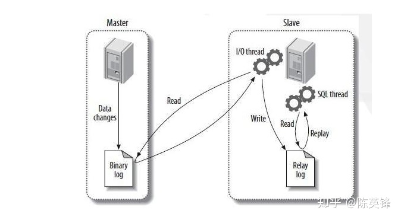

# MySQL

## 集群

### [vitess](https://vitess.io/docs/14.0/get-started/local/)

### 集群要求

参考[项目地址](https://programmer.group/61613762dcbdb.html)

- 搭建主N从MySQL Cluster；
- 从节点可以横向扩展；
- 所有的写操作只能在Master节点上进行；
- 所有的读操作都可以在所有节点上进行；

MySQL主从复制示意图


据上示意图所示，部署一个 Master-Slave MySQL Cluster的关键是配置Master节点和Slave节点的复制和同步。

总结关键步骤为：

1. 配置安装Master节点的MySQL；
2. 通过XtraBackup将Master节点的数据备份到指定目录；
3. 将步骤2备份的目录连同备份信息文件复制到 Slave 的 /var/lib/mysql，然后执行CHANGE MASTER TO指令；
4. 启动Slave节点，执行START SLAVE命令；
5. 向集群中添加更多的Slave节点；

### ConfigMap

ConfigMap为Master/Slave节点分配不同的配置文件

configmap.yaml 
```docker
apiVersion: v1
kind: ConfigMap
metadata:
  name: mysql
  namespace: mysql
  labels:
    app: mysql
data:
  master.cnf: |
    # Master configuration
    [mysqld]
    log-bin
  slave.cnf: |
    # Slave configuration
    [mysqld]
    super-read-only

```
- master.cnf 启用log-bin，即使用二进制日志文件进行主从复制。
- slave.cnf 开启super-read-only，即从节点拒绝除主节点的数据同步操作之外的所有写操作，即对用户是只读的。

### secret.yaml

secret.yaml
```docker
# Secret configure password for mysql Cluster
apiVersion: v1
kind: Secret
metadata:
  name: mysql-secret
  namespace: mysql
  labels:
    app: mysql
type: Opaque
data:
  password: dVVOMzgjJXBx # echo -n 'uUN38#%pq' |base64
```

### mysql-service.yaml

```docker
#Create services. The master and slave are mysql and mysql read
apiVersion: v1
kind: Service
metadata:
  name: mysql
  namespace: mysql
  labels:
    app: mysql
spec:
  ports:
  - name: mysql
    port: 3306
  clusterIP: None
  selector:
    app: mysql
---
apiVersion: v1
kind: Service
metadata:
  name: mysql-read
  namespace: mysql
  labels:
    app: mysql
spec:
  ports:
  - name: mysql
    port: 3306
  selector:
    app: mysql
```

- 这两个服务都代理了所有带有 app=mysql 标签的 Pod，即所有 MySQL Pod。端口映射使用Service的3306端口对应Pod的3306端口
- 名为“MySQL”的服务是无头服务（即 clusterIP=None）。它的作用是通过给Pod分配DNS记录来修复Pod集群，比如“mysql-0.mysql”、“mysql-1.mysql”等DNS名称。“mysql-0.mysql”的节点是我们的主节点；名为“MySQL read”的服务是常规服务
- 规定所有用户的读请求必须访问名为“MySQL read”的Service分配的DNS记录，这样读请求才能转发到任意一个MySQL主节点或从节点；对于所有用户的写请求，必须访问 MySQL 的主节点，DNS 记录“mysql-0.mysql”

### mysql-statefulset.yaml

```docker
apiVersion: apps/v1
kind: StatefulSet
metadata:
  name: mysql
  namespace: mysql
  labels:
    app: mysql
spec:
  selector:
    matchLabels:
      app: mysql
  serviceName: mysql
  replicas: 3
  template:
    metadata:
      labels:
        app: mysql
    spec:
      initContainers:
      - name: init-mysql
        image: jinyuyun.top/mysql:8.0
        env:
        - name: MYSQL_ROOT_PASSWORD
          valueFrom:
            secretKeyRef:
              name: mysql-secret
              key: password
        command:
        - bash
        - "-c"
        - |
          set -ex
          # Generate the server ID from the serial number of the Pod
          [[ $(hostname) =~ -([0-9]+)$ ]] || exit 1
          ordinal=${BASH_REMATCH[1]}
          echo [mysqld] > /mnt/conf.d/server-id.cnf
          # Since the server ID cannot be 0, add 100 to the ID to avoid it
          echo server-id=$((100 + $ordinal)) >> /mnt/conf.d/server-id.cnf
          # If the serial number of Pod is 0, it indicates that it is a Master node. Copy the Master configuration file from ConfigMap to the / mnt/conf.d directory
          # Otherwise, copy the Slave configuration file in ConfigMap
          if [[ ${ordinal} -eq 0 ]]; then
            cp /mnt/config-map/master.cnf /mnt/conf.d
          else
            cp /mnt/config-map/slave.cnf /mnt/conf.d
          fi
        volumeMounts:
        - name: conf
          mountPath: /mnt/conf.d
        - name: config-map
          mountPath: /mnt/config-map
      - name: clone-mysql
        image: jinyuyun.top/xtrabackup:2.3
        env:
        - name: MYSQL_ROOT_PASSWORD
          valueFrom:
            secretKeyRef:
              name: mysql-secret
              key: password
        command:
        - bash
        - "-c"
        - |
          set -ex
          # The copy operation only needs to be started for the first time, so if the data already exists, it will be skipped
          [[ -d /var/lib/mysql/mysql ]] && exit 0
          # The Master node (with sequence number 0) does not need this operation
          [[ $(hostname) =~ -([0-9]+)$ ]] || exit 1
          ordinal=${BASH_REMATCH[1]}
          [[ $ordinal == 0 ]] && exit 0
          # Use the ncat instruction to remotely copy data from the previous node to the local node
          ncat --recv-only mysql-$(($ordinal-1)).mysql 3307 | xbstream -x -C /var/lib/mysql
          # Execute -- prepare so that the copied data can be used for recovery
          xtrabackup --prepare --target-dir=/var/lib/mysql
        volumeMounts:
        - name: data
          mountPath: /var/lib/mysql
          subPath: mysql
        - name: conf
          mountPath: /etc/mysql/conf.d
      containers:
      - name: mysql
        image: jinyuyun.top/mysql:8.0
        env:
#        - name: MYSQL_ALLOW_EMPTY_PASSWORD
#          value: "1"
        - name: MYSQL_ROOT_PASSWORD
          valueFrom:
            secretKeyRef:
              name: mysql-secret
              key: password
        ports:
        - name: mysql
          containerPort: 3306
        volumeMounts:
        - name: data
          mountPath: /var/lib/mysql
          subPath: mysql
        - name: conf
          mountPath: /etc/mysql/conf.d
        resources:
          requests:
            cpu: 500m
            memory: 1Gi
        # livenessProbe:
          # exec:
            # command: ["mysqladmin", "ping", "-uroot", "-p${MYSQL_ROOT_PASSWORD}"]
          # initialDelaySeconds: 30
          # periodSeconds: 10
          # timeoutSeconds: 5
        # readinessProbe:
          # exec:
            # command: ["mysqladmin", "ping", "-uroot", "-p${MYSQL_ROOT_PASSWORD}"]
          # initialDelaySeconds: 5
          # periodSeconds: 2
          # timeoutSeconds: 1
      - name: xtrabackup
        image: jinyuyun.top/xtrabackup:2.3
        ports:
        - name: xtrabackup
          containerPort: 3307
        env:
        - name: MYSQL_ROOT_PASSWORD
          valueFrom:
            secretKeyRef:
              name: mysql-secret
              key: password
        command:
        - bash
        - "-c"
        - |
          set -ex
          cd /var/lib/mysql
          # Read Master from backup information file_ LOG_ File and master_ LOG_ The values of the two POS fields are used to assemble the cluster and initialize SQL
          if [[ -f xtrabackup_slave_info ]]; then
            # If xtrabackup_ Slave_ The info file exists, indicating that the backup data comes from another Slave node
            # In this case, the XtraBackup tool has automatically generated the "CHANGE MASTER TO" SQL statement in this file during backup
            # So, just rename the file change_master_to.sql.in, which can be used directly later
            mv xtrabackup_slave_info change_master_to.sql.in
            # Therefore, there is no need for xtrabackup_binlog_info
            rm -f xtrabackup_binlog_info
          elif [[ -f xtrabackup_binlog_info ]]; then
            # If only xtrabackup exists_ binlog_ Info file, indicating that the backup comes from the Master node, you need to parse the backup information file and read the values of the two required fields
            [[ $(cat xtrabackup_binlog_info) =~ ^(.*?)[[:space:]]+(.*?)$ ]] || exit 1
            rm xtrabackup_binlog_info
            # Assemble the values of the two fields into SQL and write them to change_master_to.sql.in file
            echo "CHANGE MASTER TO MASTER_LOG_FILE='${BASH_REMATCH[1]}',\
                  MASTER_LOG_POS=${BASH_REMATCH[2]}" > change_master_to.sql.in
          fi
          # If change exists_ master_ To.sql.in, which means cluster initialization is required
          if [[ -f change_master_to.sql.in ]]; then
            # However, you must wait for the MySQL container to start before you can connect to MySQL in the next step
            echo "Waiting for mysqld to be ready(accepting connections)"
            until mysql -h 127.0.0.1 -uroot -p${MYSQL_ROOT_PASSWORD} -e "SELECT 1"; do sleep 1; done
            echo "Initializing replication from clone position"
            # Change file_ master_ Change the name of to.sql.in
            # Prevent the Container from restarting because change is found again_ master_ To.sql.in to repeat the initialization process
            mv change_master_to.sql.in change_master_to.sql.orig
            # Using change_ master_ The contents of to.sql.orig, that is, the SQL assembled earlier, form a complete SQL statement for initializing and starting Slave
            mysql -h 127.0.0.1 -uroot -p${MYSQL_ROOT_PASSWORD} << EOF
          $(< change_master_to.sql.orig),
            MASTER_HOST='mysql-0.mysql.mysql',
            MASTER_USER='root',
            MASTER_PASSWORD='${MYSQL_ROOT_PASSWORD}',
            MASTER_CONNECT_RETRY=10;
          START SLAVE;
          EOF
          fi
          # Use ncat to listen on port 3307.
          # Its function is to directly execute xtrabackup --backup command to back up MySQL data and send it to the requester when receiving the transmission request
          exec ncat --listen --keep-open --send-only --max-conns=1 3307 -c \
            "xtrabackup --backup --slave-info --stream=xbstream --host=127.0.0.1 --user=root --password=${MYSQL_ROOT_PASSWORD}"
        volumeMounts:
        - name: data
          mountPath: /var/lib/mysql
          subPath: mysql
        - name: conf
          mountPath: /etc/mysql/conf.d
      volumes:
      - name: conf
        emptyDir: {}
      - name: config-map
        configMap:
          name: mysql
  volumeClaimTemplates:
  - metadata:
      name: data
    spec:
      accessModes:
      - "ReadWriteMany"
      storageClassName: jyy-cephfs-sc
      resources:
        requests:
          storage: 3Gi
```